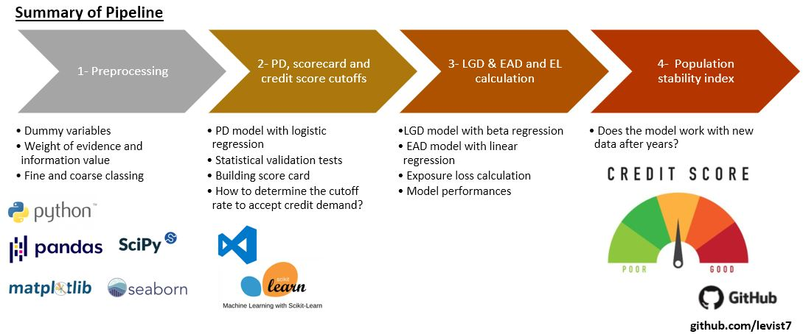

# Credit Risk Modelling | Calculation of PD, LGD, EDA and EL with Machine Learning in Python  


## Table of contents
* [Background](#background)
* [Project](#project)
* [Pipeline](#pipeline)
* [Key documents](#key-documents)
* [Datasets](#datasets)
* [Model performances](#model-performances)  
* [Deliverables](#deliverables)
* [Getting Started](#getting-started)
* [Technologies](#technologies)
* [Top-directory layout](#top-directory-layout)
* [License](#license)
* [Author](#author)

## Background

Credit risk modeling is important for financial institutions. It represents the risk of borrower not being able to pay back the loan amount, credit card or other types of loans. In some cases, borrowers can pay only partial of the amount and the principal amount and interest amount are not paid. Both statistics and machine learning play an important role in handling big data and provide statistical modeling. 

## Pipeline  




## Project

This project is an AI-powered project to model the credit risk in compliance with the Basel accords.

The goal is to build a credit risk model by using Loan Data to provide a scorecard for a daily use as well as a pipeline to calculate exposure loss.

Here is a step-by-step instruction as also in compliance with the Basel II requirements:

*  Preprocessing - Converting columns into dummy variables by fine and coarse classing
*  Calculate the PD model with logistic regression
*  Based on PD model, provide a practical scorecard in csv format
*  Construct LGD model with beta regression
*  Build EAD model with linear regression
*  Calculate the exposure loss after obtaining all models
*  Check the models if they are still doing good with the recent credit risk modeling.

Please note that this notebook includes my revisions/additions to the credit risk course on [365 Learning](https://365datascience.com/courses/credit-risk-modeling-in-python/).

## Key documents
	
Notebooks shown below:  
**L01** - A preprocessing notebook and feature engineering  
**L02** - A notebook on modelling probability of default (PD), delivering scorecard and calculating cutoff rate   
**L03** - A notebook on modelling loss given default (LGD), exposure at default (EAD) and expected loss (EL)  
**L04** - A notebook on checking population stability index  

## Datasets

The dataset comes from Lending Club. It is a large US peer-to-peer lending company. Different versions of this dataset existing, here the data was taken from a version available on [kaggle.com](https://www.kaggle.com/wendykan/lending-club-loan-data/version/1) 

It contains all available data for more than 800,000 consumer loans issued from 2007 to 2015.

The data was then divided into two: one including data from 2007 to 2014 and another including data of 2015. Assuming that data from 2007 to 2014 are available at the moment when Expected Loss models are built. Then, the models are checked with more recent data (data on 2015) to evaluate whether the applications we have received after building the Probability of Default (PD) model have similar characteristics with the applications or not.  

## Model performances

Following models are trained for the use in our case  
1.  Probability of default (PD)  
**Model**: Logistic regression  
**Metrics**: Accuracy: 0.572 | Area under ROC: 0.684 > 0.50  

2.  Loss given default (LGD)  
**Model - Stage/step 1**: Logistic regression  
**Metrics**: Accuracy: 0.595 | Area under ROC: 0.640 > 0.50  
**Model - Stage/step 2**: Linear regression  
**Metric**: Accuracy: 0.777

3. Exposure at default (EAD)  
**Model**: Linear regression  
**Metric**: Accuracy: 0.658  

*Please note that further steps can be taken forward to improve the performance of models.*

## Deliverables

1. Scorecard, easy to interpret in comliance with the requirements    
2. Dataframe to test the impact of cut off rates on the number of accepted borrowers for credit
3. Models on loss given default (LGD), exposure at default (EAD) and expected loss (EL)  
4. Schema to check the population stability index with the recent data  

## Key documents
	
Notebooks  
1 - A preprocessing notebook  
2 - A notebook on selecting features for probability of default (PD) and modelling PD  
3 - A notebook on modelling loss given default (LGD), exposure at default (EAD) and Expected Loss (EL)  
4 - A notebook on checking population stability index  

## Technologies

Project is created with:
* Python 3.8
* Jupyter Notebook 6.4.12
* Python libraries (see /requirements.txt)
* VSCode 1.71.2

Or, the github project can be readily loaded on [colab-google](https://colab.research.google.com) without any local installation. It is free and requires a signing up. There are instructions on how to load github repos on colab-google.

## Getting Started

To run this project, 
1. Clone the repo:
   ```sh
   git clone https://github.com/levist7/Credit_Risk_Modelling.git
   ```
2. Install [packages](#technologies)

3. Install python libraries
   ```sh
   pip3 install -r requirements.txt
   ```
   
## Top-directory layout

    .
    ├── NoteBooks               # Jupyter notebooks   
    ├── src                     # Scripts on functions 
    ├── data                    # Datasets (some data are stored in Gdrive)    
    ├── LICENSE
    ├── README.md 
    └── requirements.txt

## License

Distributed under the MIT License. See LICENSE.txt for more information.

## Author  

* [levist7](https://github.com/levist7)
---
Made with ❤️ in Paris
---
